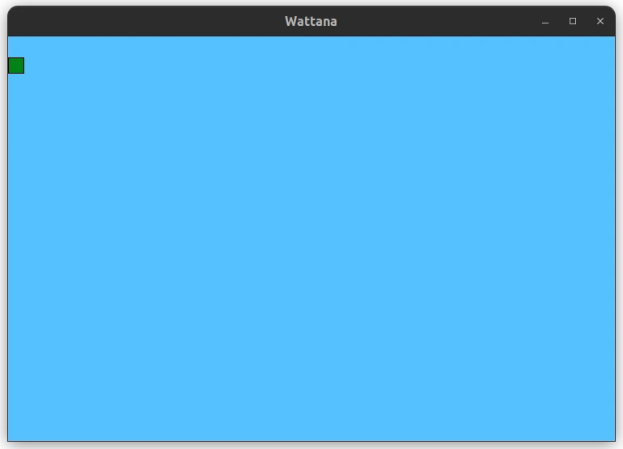

# Wattana

A simple 2D game written in C++ using SFML.



## Install
```
sudo apt-get install libsfml-dev
```

Headers files that can be included in SFML
```
#include <SFML/Graphics.hpp>
#include <SFML/Audio.hpp>
#include <SFML/System.hpp>
#include <SFML/Window.hpp>
#include <SFML/Network.hpp>
```

Linker options
```
-lsfml-graphics
-lsfml-window 
-lsfml-system 
-lsfml-audio 
-logg 
-lvorbis 
-lvorbisenc 
-lvorbisfile
```
